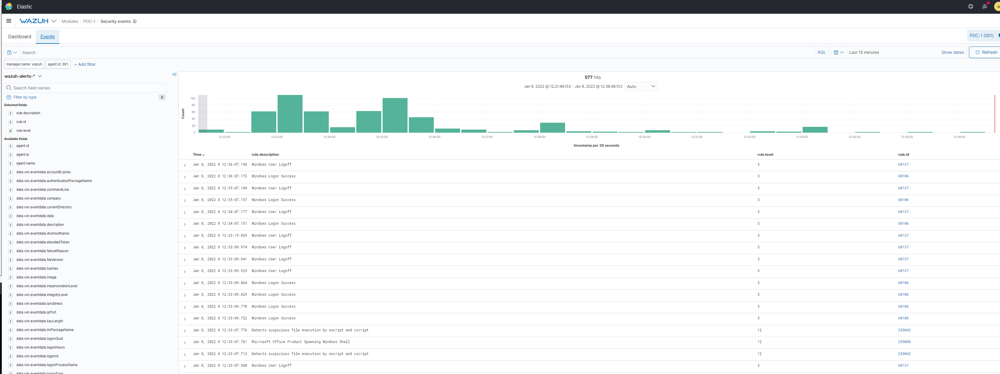
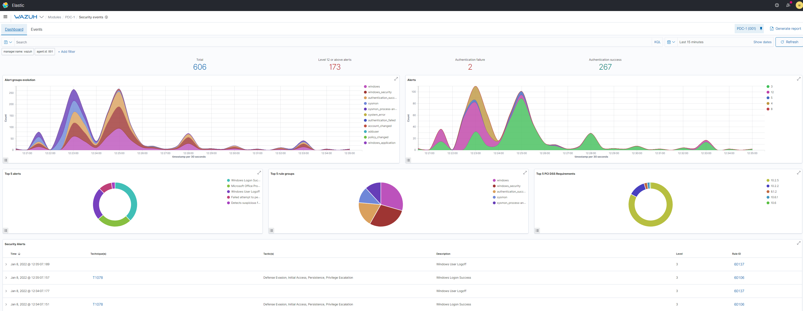
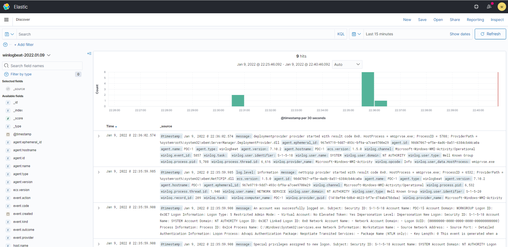
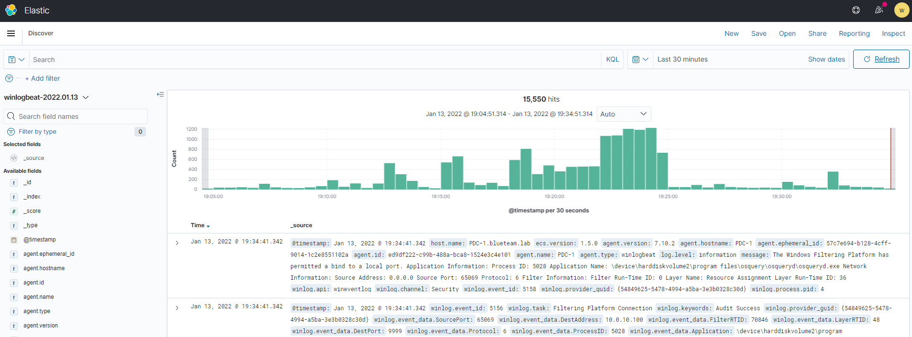

# BlueTeamLab


# Purpose

This project contains a set of **Terraform** and **Ansible** scripts to create an orchestrated Blue Team Detection Lab. The goal of this project is to provide red and blue teams with ability to deploy ad-hoc detection lab to test various attacks and forensic artifacts on latest Windows environment and then to get 'SOC-like' view into generated data. 

NOTE: This lab is deliberately designed to be insecure. Please do not connect this system to any network you care about.

--- 

# Lab Layout


---

# Prerequisites

A number of features need to be installed on your system in order to use this setup. 
```
# Step 1 - Install Azure CLI. More details on https://docs.microsoft.com/en-us/cli/azure/install-azure-cli-linux?pivots=apt
curl -sL https://aka.ms/InstallAzureCLIDeb | sudo bash

# Step 2 - Install Terraform. More details on https://learn.hashicorp.com/tutorials/terraform/install-cli
sudo apt-get update && sudo apt-get install -y gnupg software-properties-common curl
curl -fsSL https://apt.releases.hashicorp.com/gpg | sudo apt-key add -
sudo apt-add-repository "deb [arch=amd64] https://apt.releases.hashicorp.com $(lsb_release -cs) main"
sudo apt-get update && sudo apt-get install terraform

# Step 3 - Install Ansible. More details on https://docs.ansible.com/ansible/latest/installation_guide/intro_installation.html
sudo apt update
sudo apt install software-properties-common
sudo add-apt-repository --yes --update ppa:ansible/ansible
sudo apt update
sudo apt install ansible

# Step 4 - Finally install python and various packages needed for remote connections and other activities
sudo apt install python3 python3-pip
pip3 install pywinrm requests msrest msrestazure azure-cli
```

Once above prerequisites are installed and working please follow deployment guide below.

# Building and Deploying BlueTeam.Lab

Once all the [prerequisites](#Prerequisites) are installed perform the following series of steps:
```
# Login to Azure from command line to ensure that access token is valid
az login

# Clone Repository and move to BlueTeam.Lab folder
git clone https://github.com/op7ic/BlueTeam.Lab.git && cd BlueTeam.Lab

# Initialize Terraform
terraform init

# Create your lab using following command. It will take roughly 30-40min to create.
terraform apply -auto-approve

# Verify layout of your enviroment using ansible
cd ansible && ANSIBLE_CONFIG=./ansible.cfg ansible-inventory --graph -i inventory.azure_rm.yml -vvv && cd ../

# To see IPs of individual hosts and other setup details use the following command: 
cd ansible && ANSIBLE_CONFIG=./ansible.cfg ansible-inventory -i inventory.azure_rm.yml -vvv --list && cd ../

# Once done, destroy your lab using following command:
terraform destroy -auto-approve
```

---
# Documentation

The following sections describes various components making up this lab along with details on how to change configuration files to modify the setup.

- [OSQuery and Fleetdm Server](documentation/osquery.md)
- [Wazuh Server and Wazuh Agent](documentation/wazuh.md)
- [Sysmon](documentation/sysmon.md)
- [WinLogBeat](documentation/winlogbeat.md)
- [Velociraptor Server and Velociraptor Agent](documentation/velociraptor.md)
- [Domain Members](documentation/winmember.md)

## Domain Controller 

---
# Features

- Fully Patched, up to date Windows AD with two workstations connected to Windows domain.
- Auditing policies configured based on [CIS Guide](https://www.cisecurity.org/blog/prepare-for-your-next-cybersecurity-compliance-audit-with-cis-resources/) to increase event visibility across Windows infrastructure. Auditpol used to configured additional settings.
- PowerShell Transcript Logs enabled
- [Sysmon64](https://docs.microsoft.com/en-us/sysinternals/downloads/sysmon) deployed across infrastructure using latest [SwiftOnSecurity](https://github.com/SwiftOnSecurity/sysmon-config) configuration for Windows devices.
- [Wazuh Server](https://wazuh.com/) configured and operational to collect logs from devices.
- [Wazuh Agents](https://documentation.wazuh.com/current/installation-guide/wazuh-agent/wazuh-agent-package-windows.html) configured across infrastructure and feeding data into Wazuh server.
- Firewall configured to only allow your own IP to access deployed systems. 
- Flexible [domain configuration file](ansible/domain_setup.yml) allowing for easy changes to underlying configuration.
- [OSQuery](https://osquery.readthedocs.io/en/stable/installation/install-windows/) and [Fleetm](https://github.com/fleetdm/fleet) installed across infrastructure, using configuration templates from [Palantir](https://github.com/palantir/osquery-configuration).
- [Velocidex Velociraptor](https://github.com/Velocidex/velociraptor) Server configured and operational.
- [Velocidex Velociraptor](https://github.com/Velocidex/velociraptor) Agents configured across infrastructure and feeding data into Velociraptor server.

---
# Firewall Configuration

The following table summarises a set of firewall rules applied across BlueTeamLab enviroment in default configuration. Please modify [main.tf](main.tf) file to add new firewall rules as needed in **Firewall Rule Setup** section.

| Rule Name | Network Security Group | Source Host | Source Port  | Destination Host | Destination Port |
| ------------- | ------------- |  ------------- |  ------------- |  ------------- |  ------------- |
| Allow-RDP  | windows-nsg  | [Your Public IP](https://ipinfo.io/json) | * | PDC-1, DETECTION1, DETECTION2  | 3389 |  
| Allow-WinRM  | windows-nsg  | [Your Public IP](https://ipinfo.io/json) | * | PDC-1, DETECTION1, DETECTION2 | 5985 |  
| Allow-WinRM-secure | windows-nsg  | [Your Public IP](https://ipinfo.io/json) | * | PDC-1, DETECTION1, DETECTION2 | 5986 |  
| Allow-SMB  | windows-nsg  | [Your Public IP](https://ipinfo.io/json) | * | PDC-1, DETECTION1, DETECTION2 | 445 |
| Allow-SSH  | wazuh-nsg  | [Your Public IP](https://ipinfo.io/json) | * | Wazuh | 22 |  
| Allow-Wazuh-Manager  | wazuh-nsg  | [Your Public IP](https://ipinfo.io/json) | * | Wazuh | 1514-1516 |  
| Allow-Wazuh-Elasticsearch | wazuh-nsg  | [Your Public IP](https://ipinfo.io/json) | * | Wazuh | 9200 |  
| Allow-Wazuh-API | wazuh-nsg  | [Your Public IP](https://ipinfo.io/json) | * | Wazuh | 55000 |  
| Allow-Elasticsearch-Cluster | wazuh-nsg  | [Your Public IP](https://ipinfo.io/json) | * | Wazuh | 9300-9400 |  
| Allow-Wazuh-GUI  | wazuh-nsg  | [Your Public IP](https://ipinfo.io/json) | * | Wazuh | 443 |  
| Allow-Velociraptor-Client-Connections  | wazuh-nsg  | [Your Public IP](https://ipinfo.io/json) | * | Wazuh | 8000 |  
| Allow-Velociraptor-GUI  | wazuh-nsg  | [Your Public IP](https://ipinfo.io/json) | * | Wazuh | 10000 |  
| Allow-Fleet-GUI  | wazuh-nsg  | [Your Public IP](https://ipinfo.io/json) | * | Wazuh | 9999 |  

Internally the following static IPs and hostnames are used in 10.0.0.0/16 range for this enviroment:

| Host  | Role | Internal IP |
| ------------- | ------------- | ------------- |
| PDC-1  | Primary Domain Controller  | 10.0.10.10 |
| Wazuh  | [Wazuh Server](https://wazuh.com/), also hosting [Velocidex Velociraptor](https://github.com/Velocidex/velociraptor) installation | 10.0.10.100 |
| DETECTION1  | Windows 10 Workstation 1 | 10.0.11.11 |
| DETECTION2  | Windows 10 Workstation 2 | 10.0.11.12 |

---
# User Configuration

The following default credentials are created during installation. Printout of actually, configured credentials will be displayed after full deployment process completes. 

| Host  | Login | Password | Role |
| ------------- | ------------- | ------------- | ------------- |
| PDC-1  | blueteam.lab\blueteam  | BlueTeamDetection0%%% | Domain Administrator for blueteam.lab domain |
| DETECTION1  | localadministrator | BlueTeamDetection0%%% | Local Administrator of DETECTION1 workstation |
| DETECTION2  | localadministrator| BlueTeamDetection0%%% | Local Administrator of DETECTION2 workstation |
| Wazuh  | blueteam | BlueTeamDetection0%%% | SSH credentials for Wazuh server | 
| Wazuh  | wazuh | BlueTeamDetection0%%% | Wazuh admin | 
| Wazuh  | admin | BlueTeamDetection0%%% | Wazuh admin | 
| Wazuh  | kibanaserver | BlueTeamDetection0%%% | Wazuh service account | 
| Wazuh  | kibanaro | BlueTeamDetection0%%% | Wazuh service account | 
| Wazuh  | logstash | BlueTeamDetection0%%% | Wazuh service account | 
| Wazuh  | readall | BlueTeamDetection0%%% | Wazuh service account | 
| Wazuh  | snapshotrestore | BlueTeamDetection0%%% | Wazuh service account | 
| Wazuh  | wazuh_admin | BlueTeamDetection0%%% | Wazuh service account | 
| Wazuh  | wazuh_user | BlueTeamDetection0%%% | Wazuh service account | 
| Wazuh  | blueteam | BlueTeamDetection0%%% |  Velociraptor web login |

In order to modify default credentials please change usernames and passwords in [domain_setup.yml](ansible/domain_setup.yml) file.

# Screenshots







# Contributing

Contributions, fixes, and improvements can be submitted directly against this project as a GitHub issue or pull request.

# Directory Structure

```
| - ansible
|  | - ansible.cfg
|  | - domain-controller.yml
|  | - domain-member.yml
|  | - domain_setup.yml
|  | - group_vars
|  |  | - all
|  |  | - wazuh
|  | - inventory.azure_rm.yml
|  | - roles
|  |  | - domain-controller
|  |  |  | - tasks
|  |  |  |  | - main.yml
|  |  | - domain-member
|  |  |  | - tasks
|  |  |  |  | - main.yml
|  |  | - fleetserver
|  |  |  | - tasks
|  |  |  |  | - main.yml
|  |  |  | - templates
|  |  |  |  | - config.yml.j2
|  |  |  |  | - ssl.crt
|  |  |  |  | - ssl.key
|  |  |  |  | - systemd-fleetm.service.j2
|  |  | - monitor
|  |  |  | - tasks
|  |  |  |  | - main.yml
|  |  | - osqueryagent
|  |  |  | - tasks
|  |  |  |  | - main.yml
|  |  |  | - templates
|  |  |  |  | - osquery.conf
|  |  |  |  | - osquery.flags.j2
|  |  |  |  | - osquery.key.j2
|  |  |  |  | - ssl.crt
|  |  |  |  | - ssl.key
|  |  |  | - vars
|  |  |  |  | - main.yml
|  |  | - sysmon
|  |  |  | - handlers
|  |  |  |  | - main.yml
|  |  |  | - tasks
|  |  |  |  | - main.yml
|  |  |  | - vars
|  |  |  |  | - main.yml
|  |  | - velociraptorclient
|  |  |  | - tasks
|  |  |  |  | - main.yaml
|  |  |  | - templates
|  |  |  |  | - clientconfig.yml.j2
|  |  |  | - vars
|  |  |  |  | - main.yml
|  |  | - velociraptorserver
|  |  |  | - tasks
|  |  |  |  | - main.yaml
|  |  |  | - templates
|  |  |  |  | - serverconfig.yml.j2
|  |  |  |  | - systemd-velociraptor.service.j2
|  |  |  | - vars
|  |  |  |  | - main.yml
|  |  | - wazuhagent
|  |  |  | - tasks
|  |  |  |  | - main.yml
|  |  |  | - templates
|  |  |  |  | - ossec.conf.j2
|  |  |  | - vars
|  |  |  |  | - main.yml
|  |  | - wazuhserver
|  |  |  | - tasks
|  |  |  |  | - main.yaml
|  |  |  | - templates
|  |  |  |  | - sysmon_rules.xml
|  |  |  |  | - unattended-installation.sh
|  |  |  |  | - wazuh-passwords-tool.sh.j2
|  |  | - winlogbeat
|  |  |  | - tasks
|  |  |  |  | - main.yml
|  |  |  | - templates
|  |  |  |  | - config.yml.j2
|  |  |  | - vars
|  |  |  |  | - main.yml
|  | - wazuh-server.yml
| - documentation
|  | - osquery.md
|  | - pic
|  |  | - map.png
|  |  | - wazuh-logs.PNG
|  |  | - wazuh-pdc.PNG
|  |  | - winlogbeat.PNG
|  | - sysmon.md
|  | - velociraptor.md
|  | - wazuh.md
|  | - winlogbeat.md
|  | - winmember.md
| - main.tf
| - README.md
| - terraform.tfstate
| - terraform.tfstate.backup
| - variables.tf
```

# Sources of Inspiration and Thanks

A good percentage of this code was borrowed and adapted from Christophe Tafani-Dereeper's [Adaz](https://github.com/christophetd/Adaz). A huge thanks for building the foundation that allowed me to design this lab environment.

# FAQ 

- I get 'Disk wks-1-os-disk already exists in resource group BLUETEAM-LAB. Only CreateOption.Attach is supported.'
Re-run terraform commands ```terraform destroy -auto-approve && terraform apply -auto-approve``` to destroy and re-create the lab. This error seems to show up when Azure doesn't clean up all the disks properly so there are leftover resources with the same name.